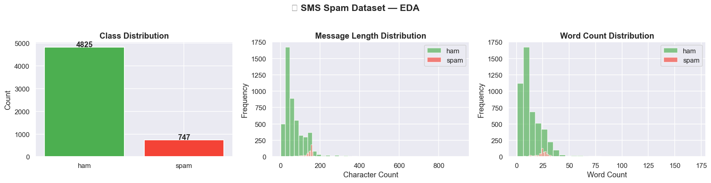
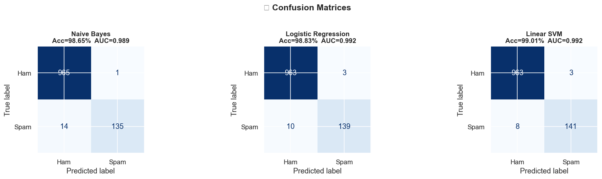
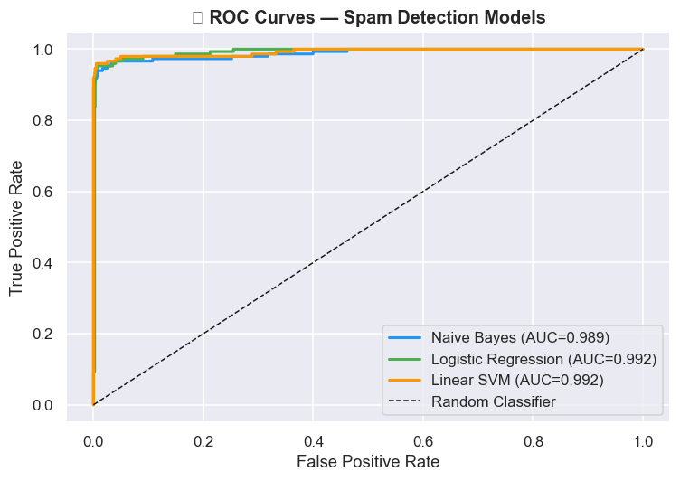
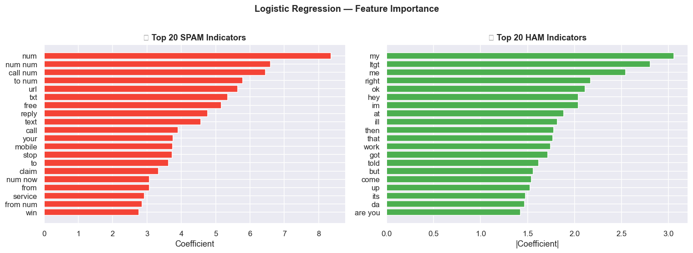

# 📧 SMS Spam Detection Pipeline

A complete Machine Learning pipeline to classify SMS messages as **Spam** or **Ham (Not Spam)**. This repository features data exploration, text preprocessing, TF-IDF feature extraction, and model training using classic machine learning algorithms.

---

## 🚀 Features

- **Automated Data Retrieval:** Automatically downloads and extracts the classic UCI SMS Spam Collection dataset.
- **Exploratory Data Analysis (EDA):** Visualizes class distributions, message lengths, and word counts.
- **Text Preprocessing:** Cleans messages by tokenizing URLs/numbers, removing punctuation, and standardizing text.
- **Multiple Models:** Trains and evaluates three classifiers:
  - Naive Bayes (MultinomialNB)
  - Logistic Regression
  - Linear Support Vector Machine (LinearSVC)
- **Detailed Evaluation:** Generates Classification Reports, Confusion Matrices, and ROC-AUC curves.
- **Feature Importance:** Identifies the top words indicating Spam vs. Ham.
- **Custom Predictions:** Easily test the trained model on your own SMS messages.

---

## 📊 Dataset Overview

The dataset consists of **5,572** SMS messages:
- **Ham (Normal):** 4,825 messages (~86.6%)
- **Spam:** 747 messages (~13.4%)

### Exploratory Data Analysis
Spam messages are typically longer and contain more words than normal messages:
- **Ham Average Length:** ~71.5 characters (14.3 words)
- **Spam Average Length:** ~138.7 characters (23.9 words)

*(Note: Run the notebook to view the distribution plots.)*



---

## 🧠 Model Training & Performance

The text is converted into numerical features using **TF-IDF Vectorization** (maximum 8,000 features, using unigrams and bigrams).

### Results (Accuracy & ROC-AUC) on Test Set
| Model | Accuracy | ROC-AUC |
|-------|----------|---------|
| **Naive Bayes** | 98.65% | 0.9887 |
| **Logistic Regression** | 98.83% | 0.9925 |
| **Linear SVM** | **99.01%** | **0.9925** |

### Confusion Matrices


### ROC Curves


---

## 🔴 Top Spam vs. 🟢 Top Ham Indicators
Using Logistic Regression, we extracted the most important features (words/tokens) driving the predictions:

- **Top Spam Words:** `txt`, `URL` (links), `claim`, `prize`, `free`, `mobile`, `win`.
- **Top Ham Words:** `my`, `me`, `im`, `come`, `later`, `but`, `if`.



---

## 💻 How to Run Locally

### 1. Requirements
Ensure you have Python 3.8+ installed. 
Install the required packages:
```bash
pip install numpy pandas scikit-learn matplotlib seaborn jupyter
```

### 2. Run the Notebook
Launch Jupyter Notebook or open the file in VS Code:
```bash
jupyter notebook spam_detection.ipynb
```

Run all cells. The dataset will be automatically downloaded during the first run.

---

## 🔍 Try Your Own Messages

At the end of the notebook, you can modify the `test_messages` list to predict if your own texts are spam or not:

```python
test_messages = [
    "Congratulations! You've won a FREE iPhone. Click here NOW to claim: http://win.com",
    "Hey, are we still on for dinner tonight at 7?",
]
```
**Output Map:**
- 🔴 **SPAM** (Probability > 50%)
- 🟢 **HAM** (Probability < 50%)
